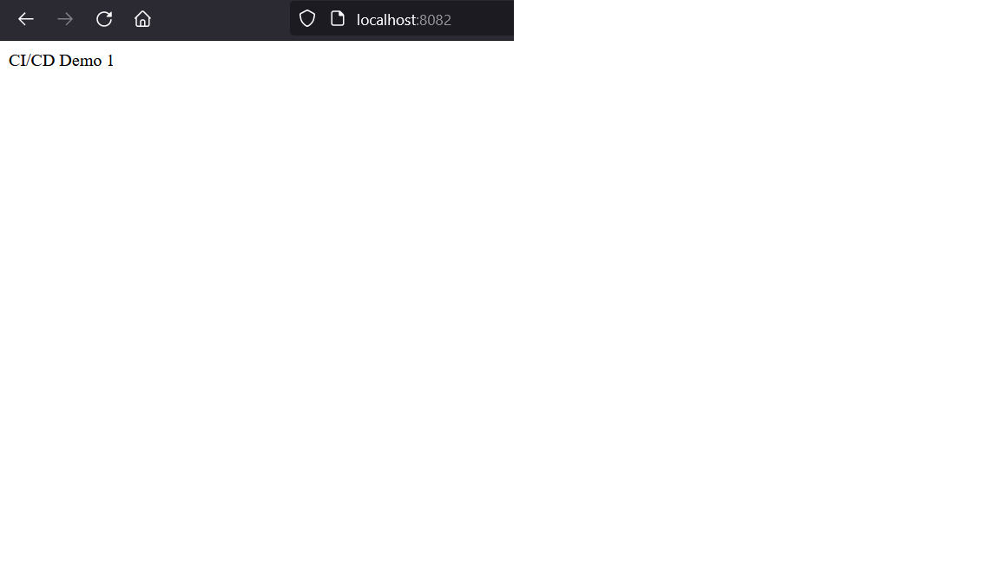
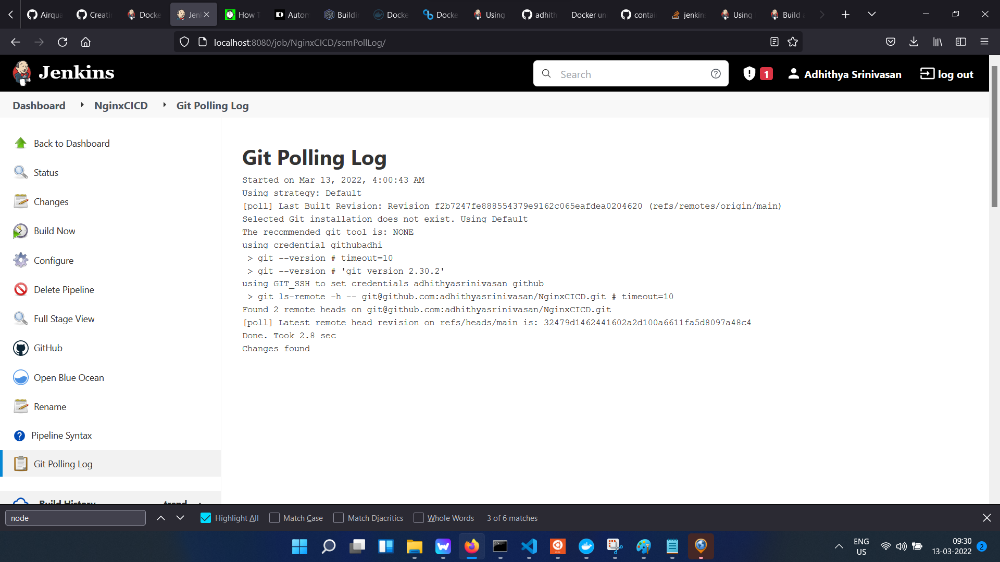

NGINX CI/CD Demo
================

1. Created a Base Container using ubuntu 18 and installed Nginx.
2. Copied the server config and the index.html inside the container.
3. Made the nginx server to run in port 8082.
4. Nginx container can be bring up using the command docker run -d -p 8082:8082 nginxtest

5. Container tests are written using pytest and utilised google-container-tests image for the same.
6. Pass the image name and the config file location to the gct image to run tests. Commented out the step in Jenkinsfile due to docker restriction in DIND.
7. Implemented Branch Protection Rules for github repository.
 
8. Once the PR is raised against main branch and the PR is approved by the administrator, the Jenkins job will poll the change and rebuild the application.

![alt text](screenshots/Version%202.png]

Files:
------

1. Jenkins file at the root of the folder to run the pipeline
2. Dockerfile at the root of the folder to build the docker image for nginx.
3. index.html for serving the static content.
4. tests/test_nginx.py which will be able to run with renatomefi/docker-testinfra:1 docker image for testing.
5. tests/Dockerfile for building the google container test repository
6. tests/test_config.yaml for the google container test config.

Steps to run the Python Script:
1. Run pip install -r requirements.txt to install the psutil module.
2. Run python python_mem_usage.py script to print the memory and cpu usage.